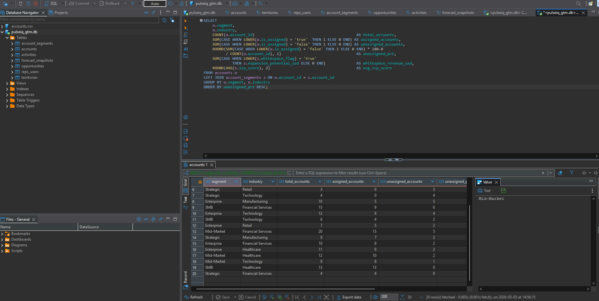
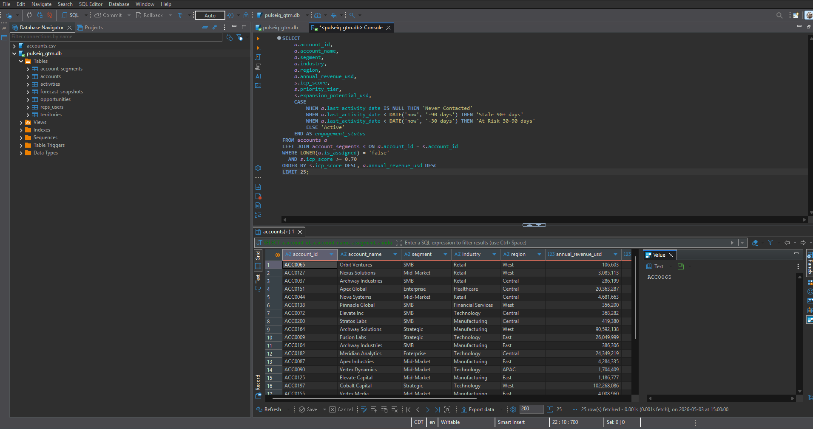
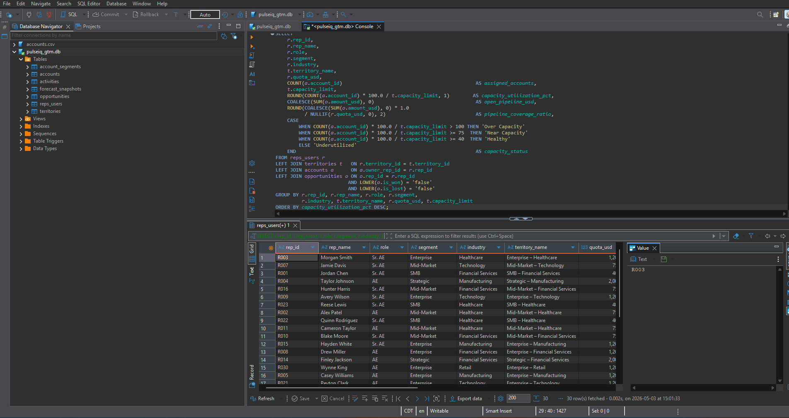
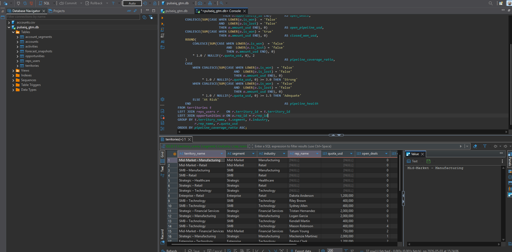
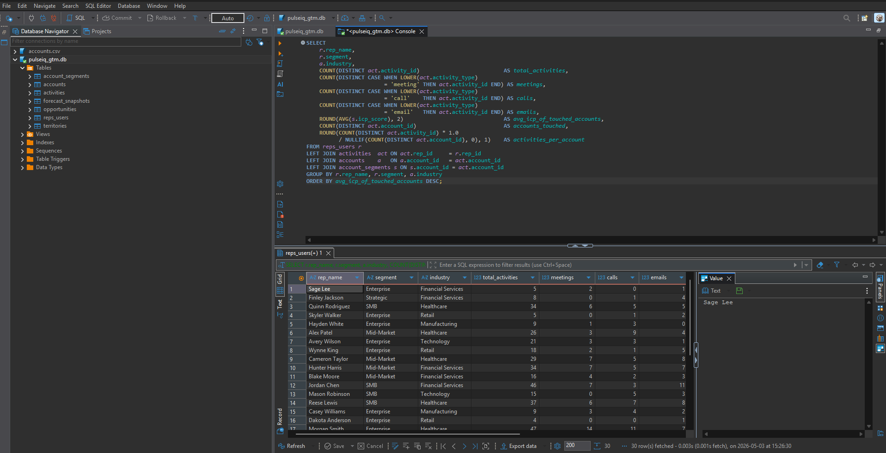
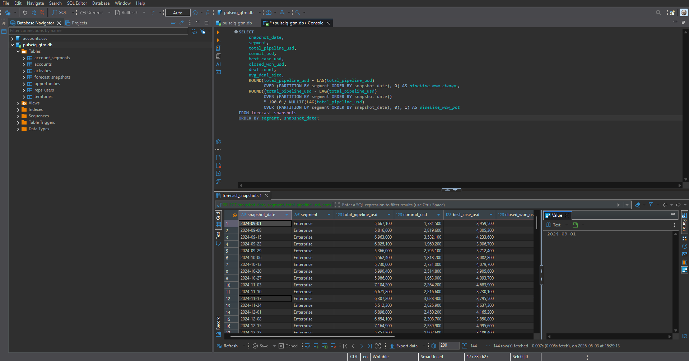
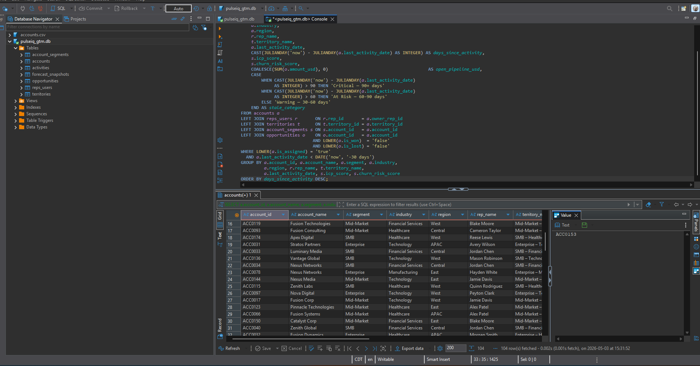

# GTM Revenue Operations Dashboard

A 5-page Power BI dashboard built to analyze pipeline health, 
rep performance, territory balance, and forecast trends.

## 🔗 Dashboard attached as PDF Below

## Pages

| Page | Description |
|---|---|
| GTM Executive Health | KPIs, pipeline trend, stale accounts |
| Coverage Gaps & Whitespace | High-ICP unassigned accounts |
| Rep Performance | Workload, activity, conversion rate |
| Forecast & Pipeline Analytics | WoW trend, commit vs best case |
| Territory Health | Account distribution, quota vs pipeline |

## Screenshots

### GTM Executive Health

### Coverage Gaps & Whitespace

### Rep Territory Balance

### Pipeline Coverage

### Activity Effectiveness

### Forecast Trend

### Stale Accounts

## SQL Techniques Used
- Window functions (LAG, RANK, ROW_NUMBER)
- CTEs (Common Table Expressions)
- Aggregations, CASE statements, date math
- 7 queries across coverage, forecast, rep, and territory analysis

## Tools
Power BI Desktop · SQL · Excel
